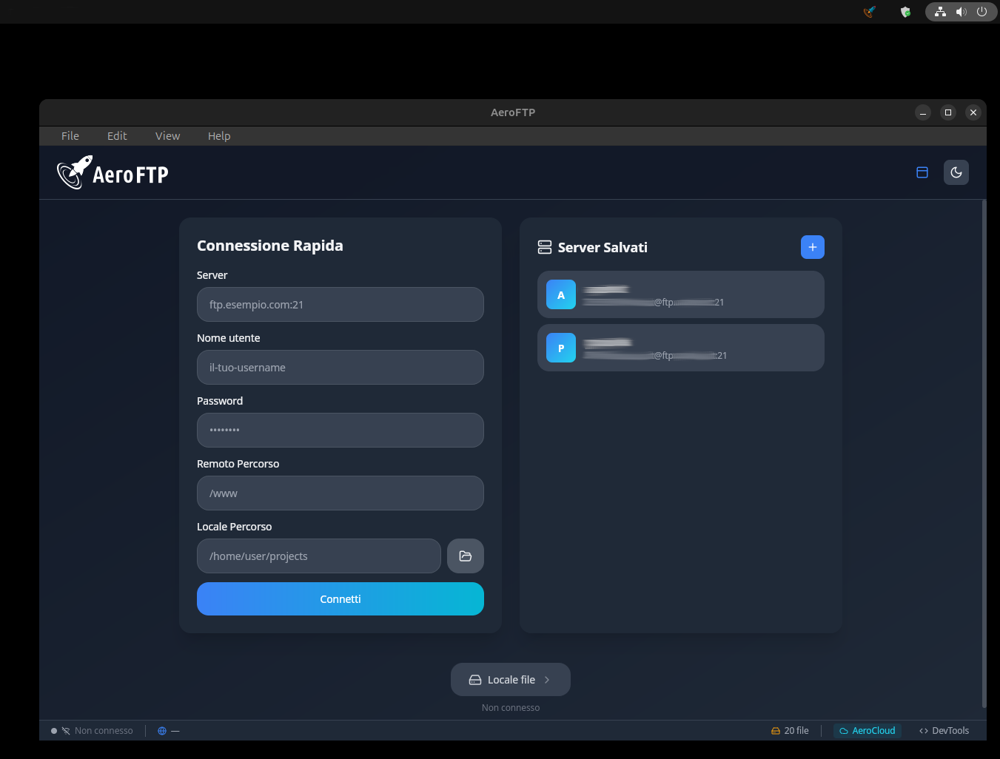
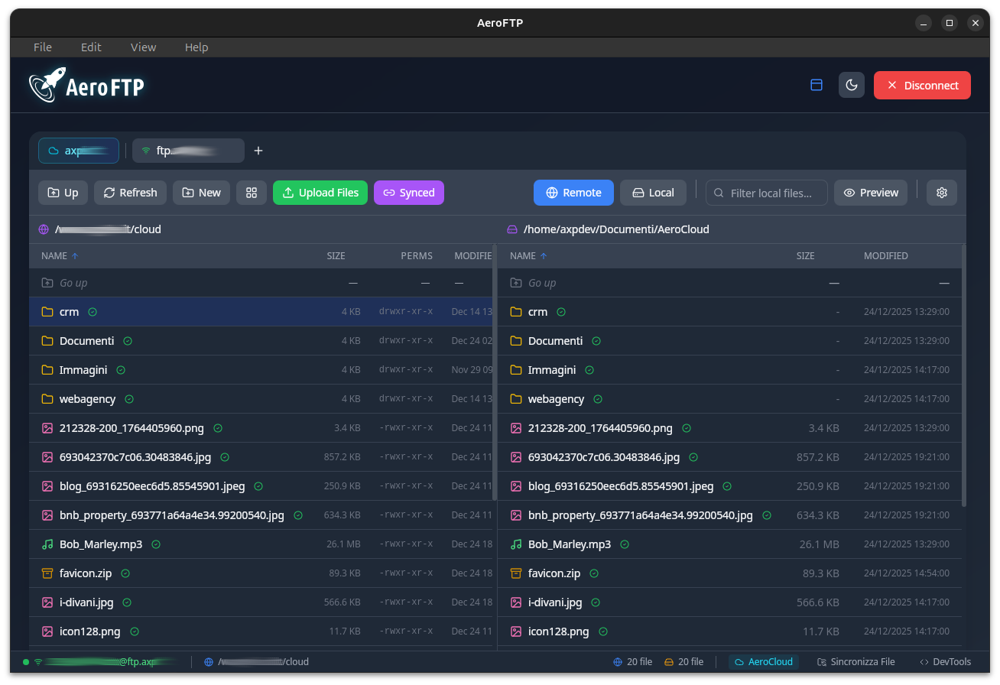

# 🚀 AeroFTP

<p align="center">
  
</p>

<p align="center">
  <strong>Fast. Beautiful. Reliable.</strong>
</p>

<p align="center">
  A modern, cross-platform FTP/FTPS and Cloud Storage client built with Rust and React.
</p>

<p align="center">
  
  
  
  
</p>

<p align="center">
  <a href="https://snapcraft.io/aeroftp"></a>
</p>

---

## ✨ Features

### 🚀 Core Features
| Feature | Description |
|---------|-------------|
| **Lightning Fast** | Built with Rust for optimal performance |
| **Beautiful UI** | Modern design with dark/light themes |
| **Dual Panel** | Remote and local file browsing side by side |
| **Multi-Tab Sessions** | Open multiple servers simultaneously |
| **FTPS Support** | Secure FTP over TLS |
| **Async Transfers** | Non-blocking with progress tracking |
| **Folder Recursion** | Full recursive upload/download/delete |

### ☁️ Multi-Provider Support (v1.2.2)
| Provider | Status | Features |
|----------|--------|----------|
| **FTP/FTPS** | ✅ Full | Browse, upload, download, sync |
| **SFTP** | ✅ Full | SSH-based secure transfers |
| **Google Drive** | ✅ Full | OAuth2, browse, upload, download, **share links** |
| **Dropbox** | ✅ Full | OAuth2, browse, upload, download, **share links** |
| **OneDrive** | ✅ Full | OAuth2, browse, upload, download, **share links** |
| **WebDAV** | 🔄 Beta | Nextcloud, ownCloud compatible |
| **S3** | 🔄 Beta | AWS, MinIO, Backblaze B2, R2 |

### 🔗 Share Links (NEW in v1.2.2)
| Provider | How It Works |
|----------|-------------|
| **Google Drive** | Creates "anyone with link can view" permission |
| **Dropbox** | Uses native Sharing API |
| **OneDrive** | Creates anonymous sharing link |
| **AeroCloud** | Uses configured `public_url_base` |

### 🔗 Navigation Sync (NEW in 0.9.9)
- **Per-session sync** - Each tab maintains its own sync state
- **Path coherence check** - Warning icon ⚠️ when local path doesn't match server
- **Automatic reset** - Sync disabled by default on new connections

### ☁️ AeroCloud
| Feature | Description |
|---------|-------------|
| **Background Sync** | Automatic file synchronization |
| **Conflict Detection** | Smart handling of file conflicts |
| **Activity Filtering** | Toggle cloud sync messages in log |
| **Dashboard** | Visual sync status and controls |

### 📋 Activity Log
Real-time activity log with dual themes:
- **Professional** - Tokyo Night-inspired elegant dark theme
- **Cyber** - Neon glow effects with CRT scanlines
- **Typewriter effect** for new entries
- **Humanized messages** in 5 languages
- **AeroCloud filter** - Hide/show cloud sync messages

### 🛠️ DevTools Panel
Integrated developer tools:
| Tab | Feature |
|-----|---------|
| **Preview** | Syntax-highlighted file preview |
| **Editor** | Monaco Editor with 20+ languages |
| **Terminal** | Local PTY terminal |

### 🤖 AI Assistant (AeroAgent)
| Feature | Description |
|---------|-------------|
| **Multi-Provider** | Gemini, OpenAI, Anthropic, Ollama |
| **FTP Tools** | List, compare, sync via natural language |
| **Smart Context** | Insert paths with `@` mention |

### 🌍 Internationalization
5 languages: English, Italian, French, Spanish, Chinese

---

## 📸 Screenshots

<p align="center">
  
</p>

<p align="center">
  
</p>

---

## 🛠️ Installation

### Snap Store (Linux)
```bash
sudo snap install aeroftp
```

### From Releases
Download for your platform:
- **Linux**: `.deb`, `.rpm`, `.AppImage`
- **Windows**: `.msi`, `.exe`
- **macOS**: `.dmg`

📥 [Download from GitHub Releases](https://github.com/axpnet/aeroftp/releases)

### Build from Source
```bash
git clone https://github.com/axpnet/aeroftp.git
cd aeroftp
npm install
npm run tauri build
```

**Prerequisites**: Node.js 18+, Rust 1.77+

---

## ⌨️ Keyboard Shortcuts

| Key | Action |
|-----|--------|
| `Ctrl+R` | Refresh |
| `Ctrl+U` | Upload |
| `Ctrl+D` | Download |
| `Ctrl+N` | New folder |
| `Delete` | Delete selected |
| `F2` | Rename |
| `Backspace` | Go up |

---

## 🏗️ Tech Stack

- **Backend**: Rust + Tauri 2.0
- **Frontend**: React 18 + TypeScript
- **Styling**: TailwindCSS
- **FTP**: suppaftp crate
- **Editor**: Monaco Editor

---

## 📝 Changelog v1.2.0

### ✨ New Features
- **Google Drive Integration** - Full OAuth2 support with browse, upload, download
- **Multi-Provider Architecture** - Unified interface for FTP, SFTP, WebDAV, S3, and cloud providers
- **Protocol Selector** - Easy switch between connection types
- **Provider Tab Icons** - Visual distinction for each provider type
- **OAuth Settings Panel** - Configure API credentials from Settings

### 🔧 Improvements
- New `StorageProvider` trait for extensible backend
- Session-based provider management
- Improved error handling for OAuth flows

### 📋 Coming Soon (v1.3.0)
- Dropbox, OneDrive, MEGA.nz
- Multi-session parallel connections
- Client-side encryption (Cryptomator-compatible)

---

## 🤝 Contributing

Contributions welcome! See [CONTRIBUTING.md](CONTRIBUTING.md)

## 📄 License

GPL-3.0 - see [LICENSE](LICENSE)

## 👥 Credits

> **🤖 AI-Assisted Development**
> - **Lead Developer**: [Axpdev](https://github.com/axpnet)
> - **AI Assistant**: Claude (Anthropic)

---

<p align="center">
  Made with ❤️ and ☕
</p>
